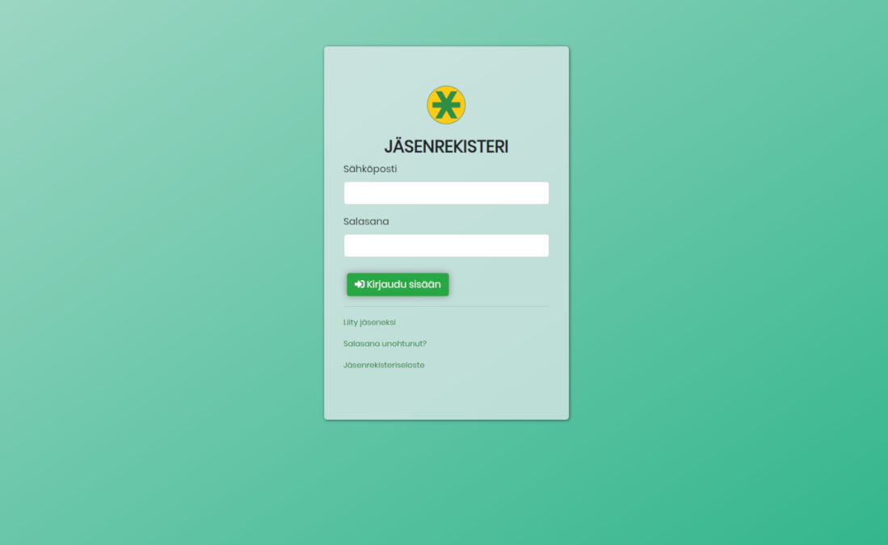

# Jäsenrekisteri-frontend
 Membership register frontend for Asteriski ry / Jäsenrekisterin frontend Asteriski ry:n tarpeisiin

Author: [Maks Turtiainen](https://github.com/mjturt)

Node.js backend is here <https://github.com/asteriskiry/jasenrekisteri-backend>.

### Tech
- React
- Bootstrap 4
- Axios

### Start
Make sure [backend](https://github.com/asteriskiry/jasenrekisteri-backend) is running.
```bash
git clone https://github.com/asteriskiry/jasenrekisteri-frontend.git
cd jasenrekisteri-frontned
cp src/config.js-sample src/config.js
npm install
npm start
```

Configure `src/config.js` if needed.

If testing [Checkout API](https://www.checkout.fi/) payment integration, local dev server must be started with HTTPS enabled.
```
HTTPS=true npm start
```
## Production

You can create static build to `build/`-directory with:
```
npm run build
```
Then you can for example configure backend to serve these files.

## Screenshots




---
© Asteriski ry
